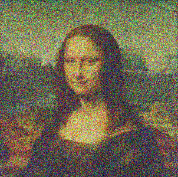
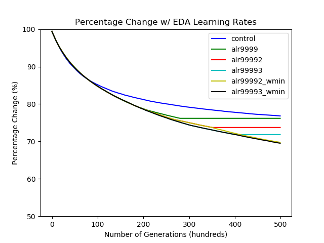

# Image Construction with Genetic Algorithm

&nbsp;&nbsp;&nbsp;&nbsp;&nbsp;&nbsp; As part of the final Project for my SOFTWARE 2S03 course, we were required to create a **Genetic Algorithm** for the construction of an image from a randomly generated PPM image. To improve the accuracy and efficacy of the software, an **Exponentially Decaying Adaptive Learning Rate** to the Genetic Algorithm was applied. The exponentially decaying adaptive learning rate demonstrated a 12% increase in efficiency.

## Mona Lisa Recreation
Depicted below is the recreation of the Famous Painting "Mona Lisa" by the Algorithm.

### Original & Recreated Image

### Gif of Image Recreation

## Application of Adaptive Learning Rate on Training Accuracy
Graph depicting the efficacy of various adaptive learning rates on a given input image.

